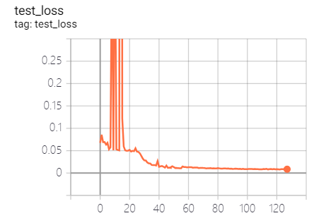

# Visual Dynamics: Probabilistic Future Frame Synthesis via Cross Convolutional Networks
An implementation based on [TensorLayer](https://github.com/tensorlayer/tensorlayer).

## Demo
Here are some preliminary results. The model is still busy training itself, and we'll add more images soon.
(Hints: these results are generated from code under `exclude-bn` branch, the `master` branch is not tested yet)

### Loss functions
It's surprising that there are outliers in overall loss and KL divergence.
| Train Loss | Test Loss | Train Loss (L2 only) |
| ---------- | --------- | -------------------- |
|  |  |  |

### Generations of image
For each column, the first row is the original image, the last row is one of the possible next frames given in the test data, and the other 6 rows in the middle are randomly sampled from our model.
| After Epoch 15 | After Epoch 31 | After Epoch 47 |
| -------------- | -------------- | -------------- |
|  |  |  |
You can see that our model (at least) learned some patterns of movement for different shapes (eg. triangles move left-bottom to right-top, circles move up-down, squares move left-right).

But till now, we can't generate next frame with **enough diversity**. We will increase the priority of KL divergence in the ensembled loss after Epoch 48.

## Usage
To train the model, just point the paths in `config.py` to where your data lives, and execute `python3 train.py`. You will see a friendly progress indicator.

By default, this program will log important info per epoch to `result/current/logs`. You can launch a TensorBoard and make use of that log. It will generate one image every 8 epochs.

A new branch is created for debugging model architecture. (While I suspect that it's not an issue related to the architecture.)

## Overall Hierarchy

