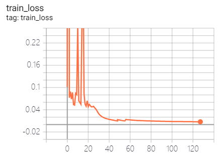

# Visual Dynamics: Probabilistic Future Frame Synthesis via Cross Convolutional Networks
An implementation based on [TensorLayer](https://github.com/tensorlayer/tensorlayer).

## Demo
Hints: these results are generated from code under `exclude-bn` branch, the `master` branch is not tested yet.

### Loss functions
It's surprising that there are outliers in overall loss and KL divergence in the first several epochs.

We increased the KL divergence priority after epoch 48 and 56.

| Train Loss | Test Loss | Train Loss (L2 only) |
| ---------- | --------- | -------------------- |
|  |  |  |

### Generations of image
For each column, the first row is the original image, the last row is one of the possible next frames given in the test data, and the other 6 rows in the middle are randomly sampled from our model.

Hints: This project is equipped with a tool to generate GIFs like these. Look up `gif_generator.py` if you are interested.

| After Epoch 23 | After Epoch 47 |
| -------------- | -------------- |
|  |  |

| After Epoch 95 | After Epoch 127 |
| -------------- | -------------- |
|  |  |

You can see that our model learned some patterns of movement for different shapes (eg. triangles move left-bottom to right-top, circles move up-down, squares move left-right), and is able to generate different movements out of a single prior image.

Maybe the next thing we'll do is to examine the underlying distribution, and to try other datasets.

## Usage
To train the model, just point the paths in `config.py` to where your data lives, and execute `python3 train.py`. You will see a friendly progress indicator.

By default, this program will log important info per epoch to `result/current/logs`. You can launch a TensorBoard and make use of that log. It will generate one image every 8 epochs.

## Overall Hierarchy

